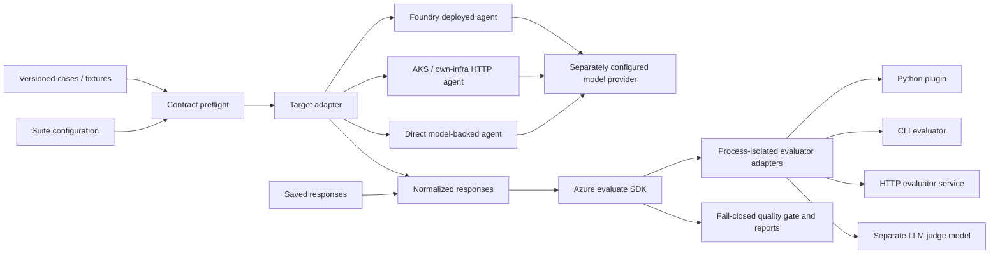

# Architecture: independently replaceable boundaries

## Boundaries

- **Case → target:** ID, query, context and metadata only. `expected` and existing
  `response` are stripped before subprocess creation. Dataset owners must not hide
  answer keys in context or metadata; the POC cannot infer such semantic leakage.
- **Case + response → evaluator:** the complete normalized Case plus evaluator options.
- **Evaluator → runner:** versioned score/reason output. Provider exceptions or malformed
  responses become invalid results rather than passing scores.
- **Runner → SDK:** one named callable per registered evaluator with explicit mappings
  for ID, query, response, context, expected and metadata. The SDK executes/aggregates;
  gate logic checks completeness and consistency rather than replacing SDK evaluation.
- **Configuration → provider:** endpoints/models/secrets referenced by environment
  variable names, not copied into result manifests.

## Two different verification loops

1. **Evaluator compatibility verification:** known pass/fail fixtures for every
   evaluator verify interface, expected behavior on those fixtures, and error paths.
2. **Agent quality evaluation:** real or explicitly saved responses are scored by
   configured evaluators and checked against quality gates.

Neither establishes statistical judge calibration. Human agreement, inter-rater
reliability, adversarial robustness, recall/precision and representative coverage
need separate datasets and criteria.

## Portable model and hosting choices

| Agent location | Model location | Target adapter |
| --- | --- | --- |
| Foundry hosted agent | Foundry or an external OpenAI-compatible service | `foundry_agent` with discovered Responses URL |
| AKS or own infrastructure | Any service reachable by the agent | canonical `http` or Responses adapter |
| Local POC | Foundry or OpenAI-compatible service | Responses localhost URL |
| No server/direct generation | Foundry, compatible service, or trusted Python provider | `model` |

`foundry_model` invokes a **model deployment**, not a deployed agent. `foundry_agent`
invokes a **deployed agent endpoint**, not a model endpoint. These concepts and
credentials are deliberately separate. Generic Responses compatibility alone does
not guarantee compatibility with all hosted Foundry session/routing versions.

The supplied server implements the Responses protocol via the installed Foundry
hosting adapter. It is single-process and uses in-memory sessions. Multi-replica
production hosting requires an explicit state strategy and host authentication.

## Current limitations

- Text input/output POC; tool trajectories, images/audio and conversation-level
  grading require explicit adapters and versioned schema extensions.
- Sync SDK runner temporarily changes cwd; use separate processes for parallel runs.
- Each score spawns a worker, favoring containment over throughput. Large-scale
  queuing, caching, distributed scheduling and cancellation are out of scope.
- Worker deadlines include startup. Choose timeouts large enough for SDK imports,
  identity acquisition and network latency, especially for LLM judges.
- APIs with non-Bearer headers, custom query parameters, native Anthropic/Google
  protocols or arbitrary output layouts need a wrapper/provider adapter.