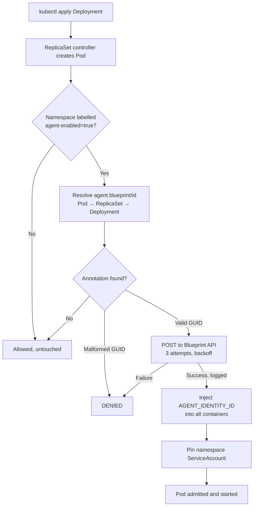

# Agent Identity Operator

A Kubernetes operator for AKS that injects an **Agent Identity Blueprint ID** into agent pods
before they start, and blocks the pod if any part of that process fails.

## Why this is an admission webhook, not a reconcile loop

The requirement *"ensure the pod starts only after all operations in the operator are complete
and successful"* can only be satisfied at admission time.

A classic controller (watch → reconcile) sees a pod **after** the API server has already
persisted and scheduled it — the kubelet may have started the container before the controller
ever reads the event. There is no way to retroactively hold it.

A **mutating admission webhook with `failurePolicy: Fail`** sits in the write path. The API
server will not persist the pod until the webhook returns, so:

| Outcome | Result |
| --- | --- |
| Blueprint API call succeeds | Pod is patched with `AGENT_IDENTITY_ID` and admitted |
| Blueprint API call fails (all retries) | Pod is **denied** — never persisted, never scheduled, never started |
| Operator is down / unreachable | Pod is **denied** by `failurePolicy: Fail` |
| Annotation missing or not a GUID | Pod is **denied** |

## Admission flow



### Annotation resolution

Kubernetes does **not** copy a Deployment's `metadata.annotations` onto the pods it creates, so
the operator walks the ownership chain to find `agent.blueprint/id`:

1. the pod's own annotations (i.e. `spec.template.metadata.annotations`)
2. the owning **ReplicaSet** (metadata, then pod template)
3. the owning **Deployment** (metadata, then pod template) ← *the manifest location in the spec*

This means the annotation works exactly where the spec places it, with no change to how teams
author their manifests.

## Scoping

Namespace scoping is enforced in **two independent places**:

- the webhook's `namespaceSelector` (`agent-enabled In [true]`), so the API server never even
  calls the operator for out-of-scope namespaces; and
- a re-check of the namespace labels inside the handler, so a misconfigured webhook object
  cannot silently widen the blast radius.

`kube-system` and the operator's own namespace are explicitly excluded, which prevents a
restart deadlock where the operator's own pods need a running operator to be admitted.

## Layout

| Path | Purpose |
| --- | --- |
| `cmd/operator/main.go` | Entrypoint, flags, manager and webhook wiring |
| `internal/agentid/` | Annotation resolution + GUID validation |
| `internal/blueprint/` | Blueprint API client with retries and success/failure logging |
| `internal/webhook/` | The mutating admission handler |
| `internal/certs/` | Self-signed serving cert + `caBundle` publication |
| `deploy/` | Namespace, RBAC, Deployment, Service, webhook config |
| `examples/` | A sample agent namespace, service account and Deployment |

## Deploy

```powershell
# 1. Build and push
$ACR = "<your-registry>.azurecr.io"
docker build -t "$ACR/agent-identity-operator:v0.1.0" .
docker push "$ACR/agent-identity-operator:v0.1.0"

# 2. Point the manifest at your image
(Get-Content deploy/03-deployment.yaml) `
  -replace 'REPLACE_ME/agent-identity-operator:v0.1.0', "$ACR/agent-identity-operator:v0.1.0" `
  | Set-Content deploy/03-deployment.yaml

# 3. Apply, in order
kubectl apply -f deploy/

# 4. Wait for readiness BEFORE labelling any namespace
kubectl -n agent-operator-system rollout status deploy/agent-identity-operator
```

> **Order matters.** Because `failurePolicy: Fail`, label namespaces `agent-enabled=true` only
> *after* the operator reports ready — otherwise pod creation in those namespaces is blocked.

### Certificates

On startup the operator generates a self-signed CA and serving certificate, stores it in the
`agent-identity-operator-webhook-cert` Secret, and patches the `caBundle` into its own
`MutatingWebhookConfiguration`. Certificates are reused across restarts and regenerated within
30 days of expiry.

If you already run **cert-manager**, set `ENABLE_CERT_BOOTSTRAP=false`, mount the cert Secret at
`/tmp/k8s-webhook-server/serving-certs`, and let cert-manager annotate the webhook instead.

## Onboarding an agent namespace

```powershell
kubectl label namespace agents-payments agent-enabled=true
```

The namespace's single existing service account is discovered automatically and pinned onto
agent pods that do not name one. If a namespace contains more than one non-`default` service
account, the operator denies the pod rather than guessing.

## Verify

```powershell
kubectl apply -f examples/agent-namespace.yaml
kubectl -n agents-payments get pods

# The injected value
kubectl -n agents-payments get pod -l app=payments-agent `
  -o jsonpath='{.items[0].spec.containers[0].env}'

# The success/failure log line
kubectl -n agent-operator-system logs deploy/agent-identity-operator | Select-String "Blueprint API call"
```

Expected log on success:

```
INFO  Agent Identity Blueprint API call SUCCESS  {"endpoint": "https://jsonplaceholder.typicode.com/posts", "agentBlueprintId": "3f2504e0-...", "namespace": "agents-payments", "attempt": 1, "httpStatus": 201}
INFO  Admitting agent pod with injected identity {"envVar": "AGENT_IDENTITY_ID", "containersPatched": 1}
```

## Configuration

| Env var | Default | Description |
| --- | --- | --- |
| `BLUEPRINT_API_URL` | `https://jsonplaceholder.typicode.com/posts` | Blueprint API endpoint |
| `BLUEPRINT_API_TIMEOUT` | `5s` | Per-attempt HTTP timeout |
| `BLUEPRINT_API_ATTEMPTS` | `3` | Total attempts before denying the pod |
| `ENFORCE_NAMESPACE_SERVICE_ACCOUNT` | `true` | Pin pods to the namespace service account |
| `ENABLE_CERT_BOOTSTRAP` | `true` | Self-manage serving certificates |
| `DEV_LOGGING` | `false` | Human-readable console logging |

Keep `BLUEPRINT_API_ATTEMPTS × BLUEPRINT_API_TIMEOUT` comfortably below the webhook's
`timeoutSeconds: 20`, or the API server will time out before the retries finish.

## Test

```powershell
docker run --rm -v "${PWD}:/src" -w /src golang:1.23 go test ./...
```

Covered: annotation resolution via the ownership chain, GUID validation, namespace scoping,
env injection, spoofed-value overwrite, and denial when the blueprint API fails.

## Operational notes

- **Two replicas + PodDisruptionBudget.** With `failurePolicy: Fail`, a single replica means a
  node drain blocks all agent pod creation cluster-wide.
- **The env var cannot be spoofed.** A pre-existing `AGENT_IDENTITY_ID` on a container is
  overwritten with the resolved value, so a workload author cannot assert someone else's identity.
- **Break-glass.** Label a pod `agent.blueprint/skip=true` to bypass the webhook via its
  `objectSelector`.
- **The API call happens per pod, not per Deployment**, so it also fires on scale-up and
  rescheduling.
