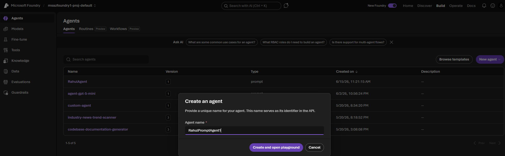
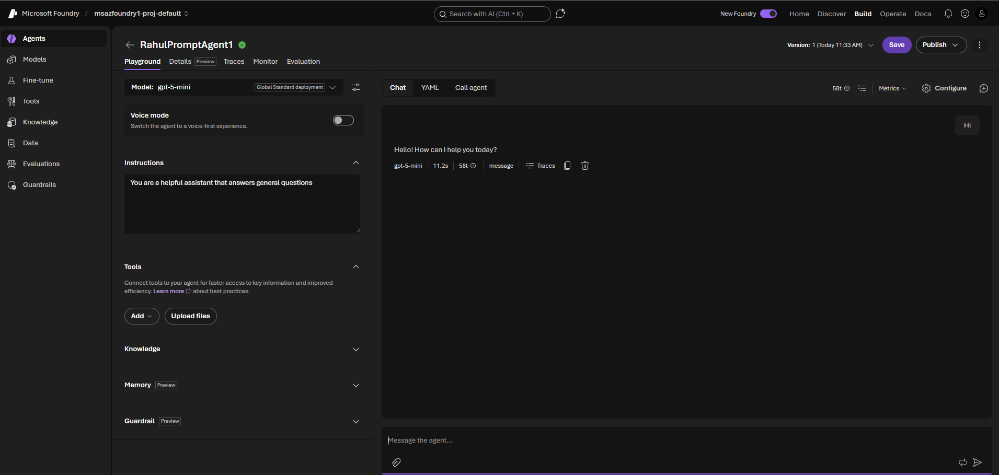
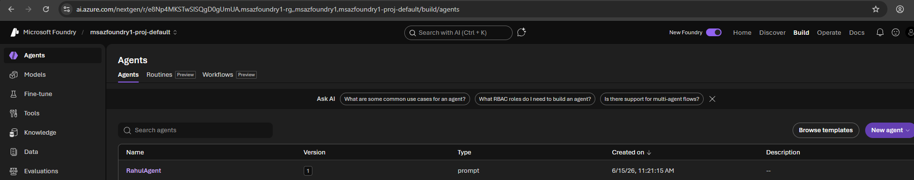
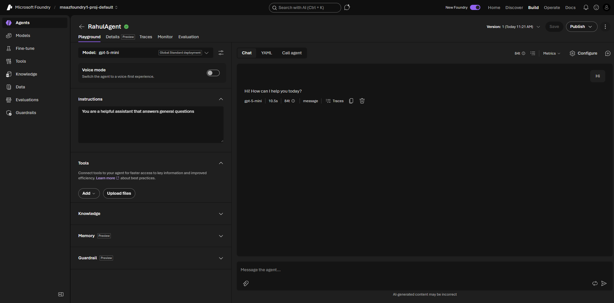
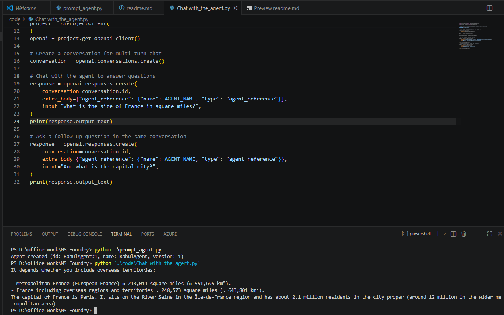

https://helloworld-a2a-agent.azurewebsites.net/.well-known/agent-card.json

Create Prompt Agent From UI

Use Prompt agent created from UI

Copied PROJECT_ENDPOINT from Foundry home page and Ran prompt_agent.py to create Foundry Prompt Agent

Use Prompt agent created from Code

Connect to the agent from outside
Run Chat_with_the_agent.py

Prompt Agent Access any user?
All users added with minimum role of "Foundry User" at project level will be able to access all Prompt Agents in Foundry project.

Prompt Agent Access any Group?
Foundry Support access at project level i.e. minimum role of "Foundry User" at project level can be assigned to AD Group be able to access all Prompt Agents in Foundry project. No segeregation within Foundry project.

Verify if technical account like SPN or UAMI can access prompt agent?
To allow a Service Principal (SP) or User-Assigned Managed Identity (UAMI) to access/invoke your prompt agent in Microsoft Foundry, assign the appropriate RBAC role (typically Foundry User) to that identity at the right scope.

Verify Observability 
Agent Tracing is preview features currently and requires Application Insights
https://learn.microsoft.com/en-us/azure/foundry/observability/concepts/trace-agent-concept
https://learn.microsoft.com/en-us/azure/foundry/observability/how-to/trace-agent-setup

Server-side traces in the Foundry portal
Foundry automatically logs server-side traces for Prompt agents, Host agents, and workflows in the Foundry portal. Once tracing is enabled in your Foundry project, you'll have access to out-of-the-box traces for the past 90 days.

https://learn.microsoft.com/en-us/azure/foundry/observability/how-to/trace-agent-setup#server-side-traces-in-the-foundry-portal

Hosted Agent:
https://learn.microsoft.com/en-us/azure/foundry/observability/how-to/trace-agent-framework#hosted-agents-deployed-to-foundry

